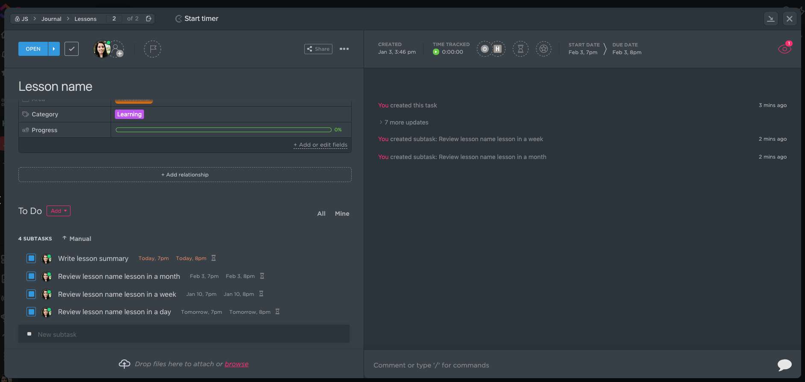

# CLI Application to create lesson reminders in ClickUp
A platzi lesson says you can remember your lessons (courses or anything you want to learn for life) if you remember the lesson in a day, a week and 1 month after the initial lesson, this tool is built to create a ClickUp task with subtasks for each reminder from the current day.

## How to use
### Steps
1. `npm install`
1. Copy the `.env.example` to `.env` and fill the variables:
    1. `LESSON_LIST_ID`: The ClickUp list where the task will be placed
    1. `CLICK_UP_TOKEN`: The ClickUp API token for your personal account, this is used to talk to the ClickUp api, you can get one by going to `Settings > My Apps > Apps > API Token` in the ClickUp app.

1. Create a lesson reminder using `npm run cli -- lesson:create --name "Lesson name"`
1. You will get something like this

